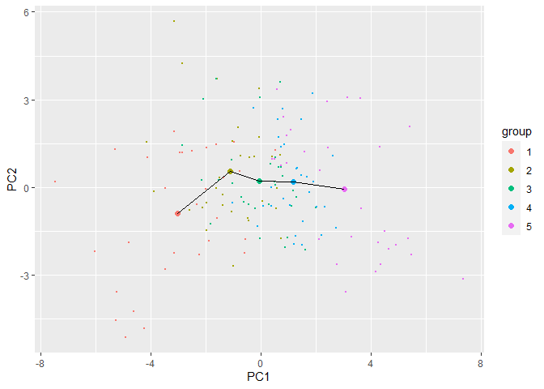

# os-PCA


## Introduction

This module is to introduce a basic example to use os-PCA procedure. To begin with, download the rice dataset from https://github.com/hjhyu0081/hjhyuntest and set appropriate directory to analyze this datasets. The numerical data and the variables are saved and assigned separately just for convenience.


You may require several other packages to perform our own package. Install those packages if needed.

```r
remotes::install_github("hjhyu0081/osPCA@main")
require(osPCA)
require(dplyr)
require(ggplot2)
require(quadprog)
```


```r
data <- scale(t(read.csv("./data/rice.csv", encoding = "UTF-8", as.is=T)[,-1]))
variables <- read.csv("./data/rice.csv")[,1]
```

Also, it is essential to set the group variables according to the group. The group variables are recommended to set by numeric varaibles.


```r
group<-c(rep(1,30),rep(2,30),rep(3,30),rep(4,30),rep(5,30))
```


## os-PCA using rice data

### `scatterplot_mean` and `con_pca`

It is well known that `prcomp` can be used to perform PCA. We provide a function `scatterplot_mean` that allows to draw scatterplot of principal components according to the group, in which each $x$ and $y$ axes can be selected by setting the third arguments. As following, the first argument of this function should be the score object of `prcomp` function and the second argument should be group variables that we assigned before.


```r
res_orgPCA <- prcomp(data, center = T, scale = T)
scatterplot_mean(res_orgPCA$x, group = group, PC = c(1,2))
```

<!-- -->

The function `con_pca` offers the results, score and basis for os-PCA, while the `prcomp` provides them for PCA. The first argument of the function `con_pca` should be numerical datasets, and the second argument should be 'constrained matrix' $A$. Finally, the third argument should be the number of components which is chosen by screeplot. 


```r
res_conPCA <- con_pca(data = data, A = making_amat(group), q = 7)
scatterplot_mean(res_conPCA$X, group = group, PC = c(1,2))
```

<!-- -->

These are screeplot code lines. As stated in our paper in Section 3.2, the screeplot function for os-PCA is pretty much similar with that of PCA  Therefore, we recommend you draw screeplot for PCA to choose the number of PCs for os-PCA to avoid numerically burdensome work. Here is a simple example for this work. Besides you can make your own useful screeplot function.

### Screeplot

```r
ggplot(data = data.frame(lambda = res_orgPCA$sdev^2, i = 1:length(res_orgPCA$sdev))) +
  geom_line(aes(x = i, y = lambda)) +
  geom_point(aes(x = i, y = lambda), size = 0.3)
```

<!-- -->

### `scoreplot`
We provide a function `scoreplot` (see Figure 3 in our paper). Two pairs of PC scores are on the plots. The gray dots display scores that are obtained from os-PCA. The black dots and red dots are from the original PCA and the rotated PC, respectively. 

```r
scoreplot(data = data, group = group, q = 7, PC = c(1,2))
```

<!-- -->
